<!-- PROJECT LOGO -->

  <a href="https://github.com/vMohd/MOH-Clone">
    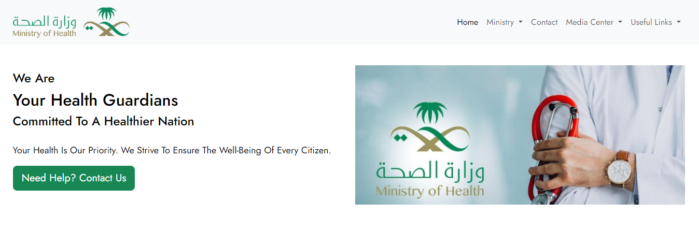
  </a>

# About MOH Clone
A project for SWE363 - Web Engineering and Development, where we developed a dynamic, simple clone of the Ministry of Health (MOH) website of Saudi Arabia. This project was designed to practice building fully functional and dynamic websites using a variety of web development technologies, including HTML, CSS, JavaScript, PHP, and MySQL, along with Bootstrap for responsive design.

## Built With

## Main Features

### Home Page

  

On MOH home page, users can navigate through different sections, About Us, News, Health Awareness Tools , Working Hours, and Contact Us.

##### Full Home Page :

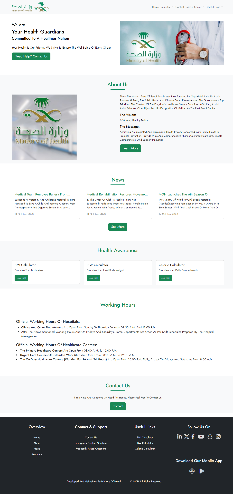

---

### About

  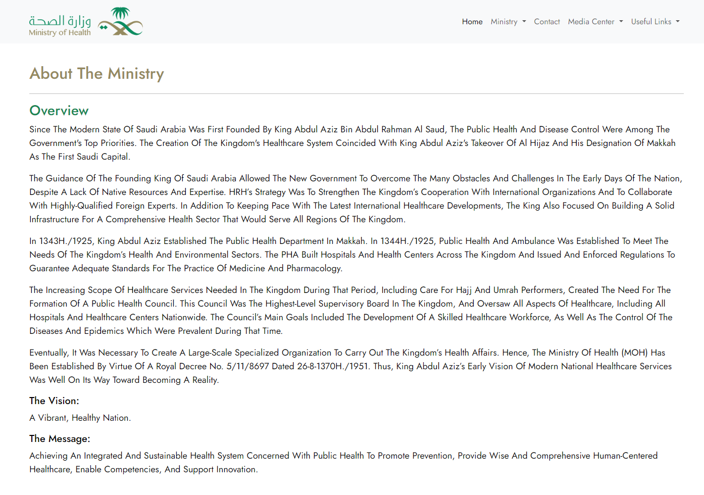

MOH About page, including details about the ministry's mission, vision, and organizational structure.

---

### Contact

  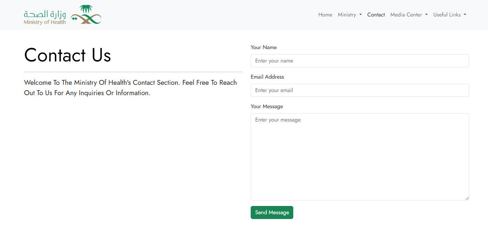

MOH Contact page with information for inquiries and a contact form.

---

### Media Center

MOH Media Center page featuring the latest news and resources.

#### News

  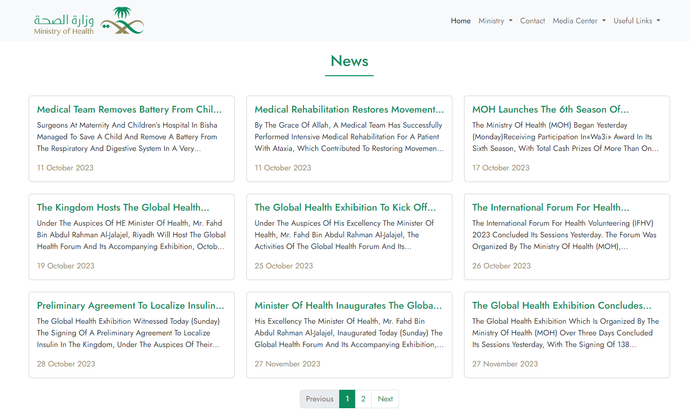

MOH News section displaying the latest updates and announcements.

---

### Useful Links

MOH Useful Links page, providing emergency contact numbers, FAQs, and health calculators.

#### Emergency Contact Numbers

  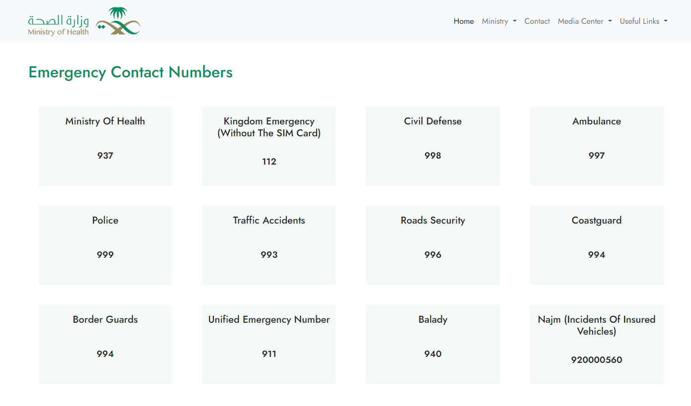

A list of emergency contact numbers and services in Saudi Arabia.

#### FAQs

  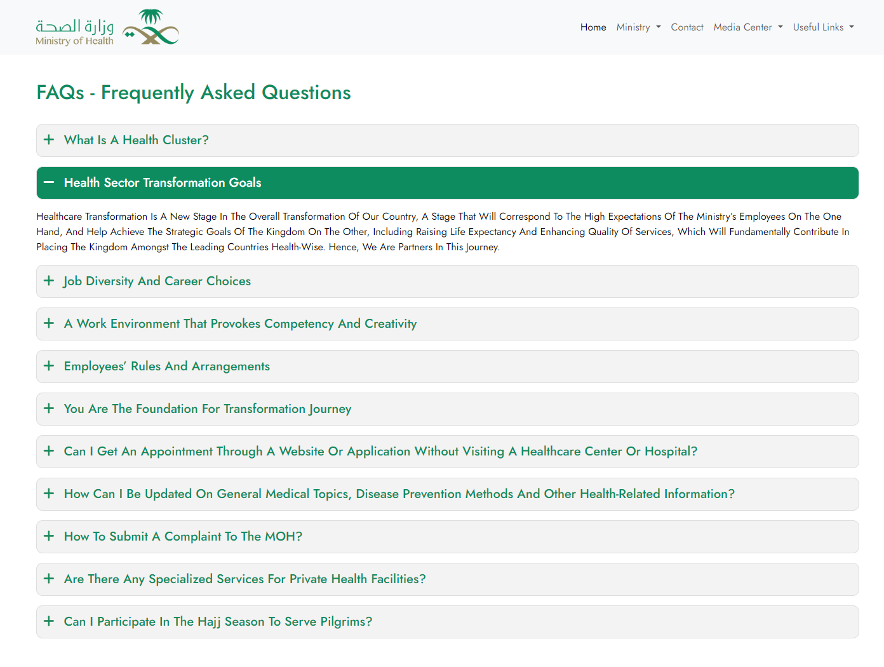

Frequently Asked Questions regarding health services and ministry operations.

**Preview of FAQs**

  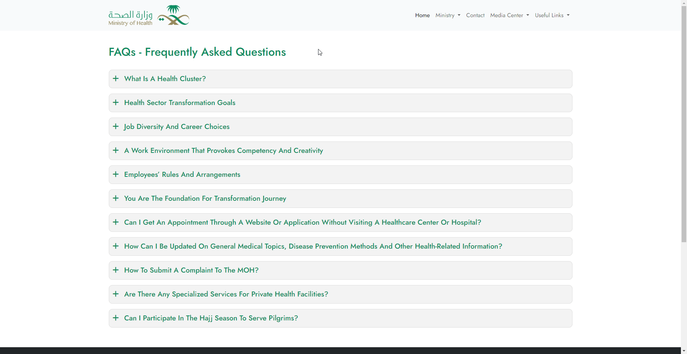

#### BMI Calculator

  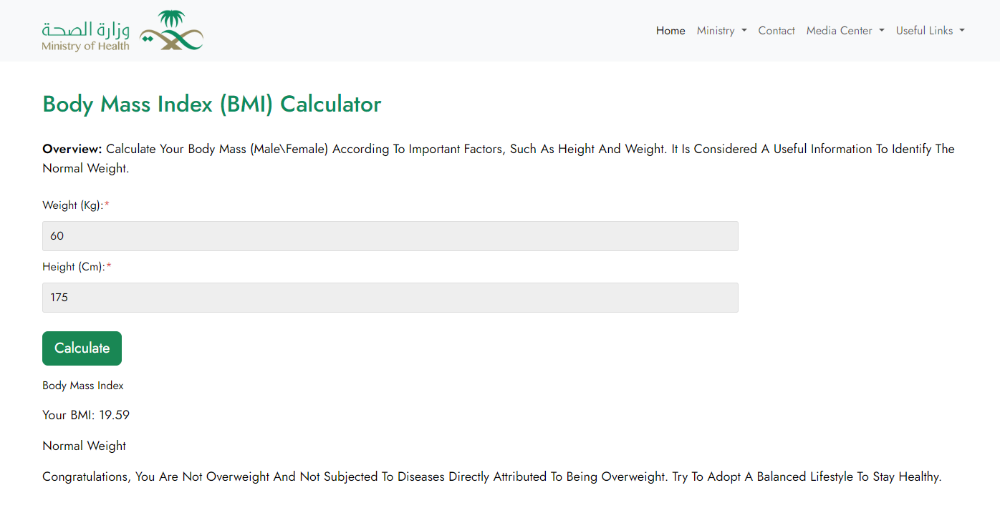

A tool to calculate Body Mass Index.

**Preview of BMI Calculator**

  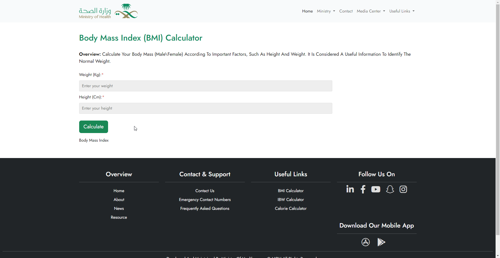

#### IBW Calculator

  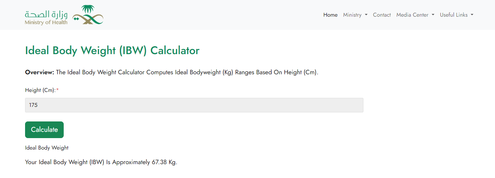

A tool to calculate Ideal Body Weight.

#### Calorie Calculator

  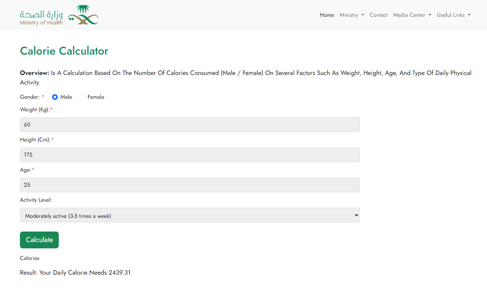

A tool to estimate daily calorie requirements.

---

